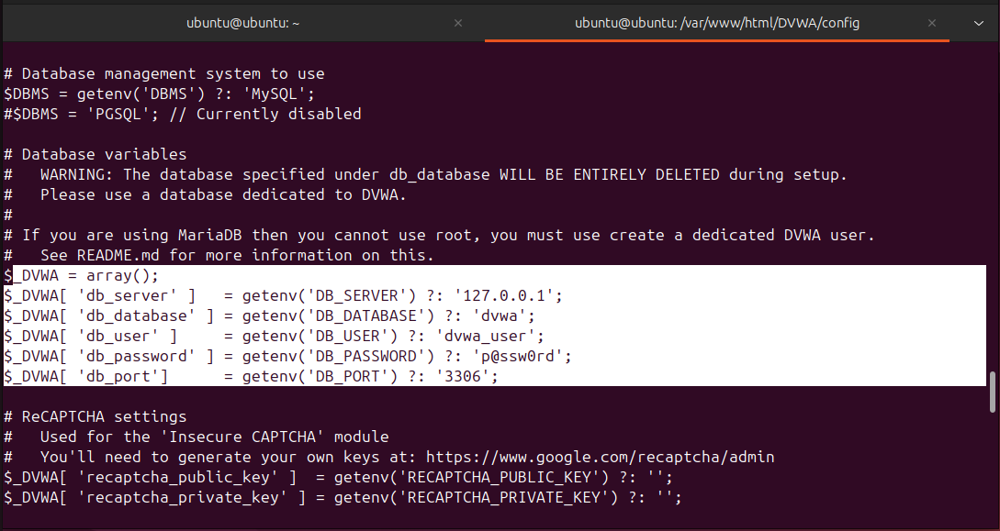
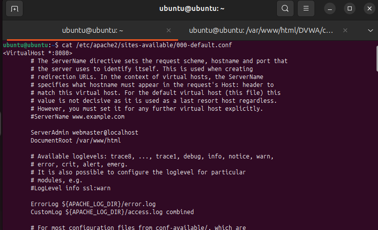
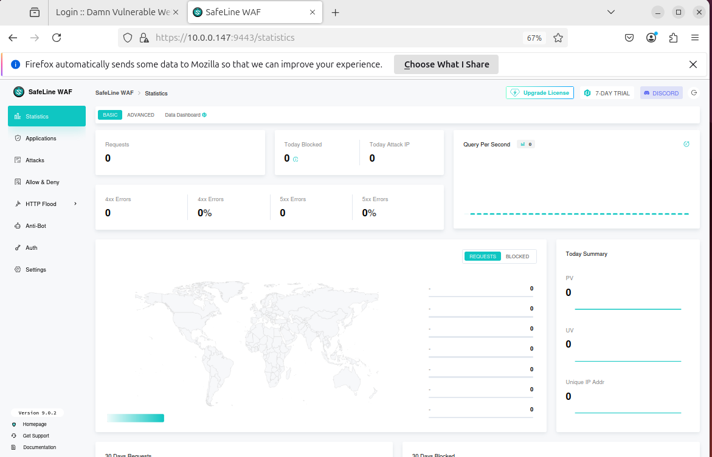
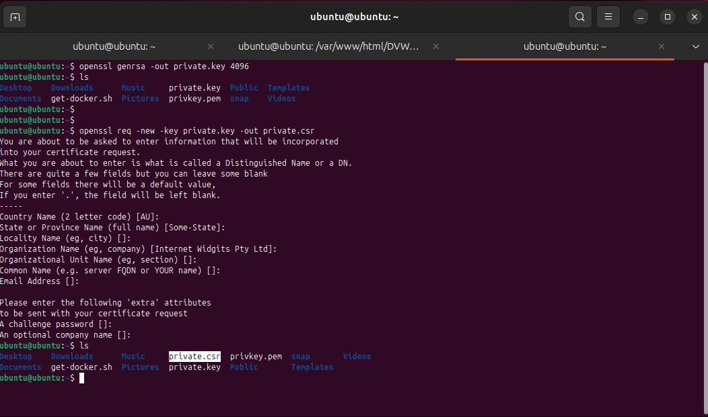
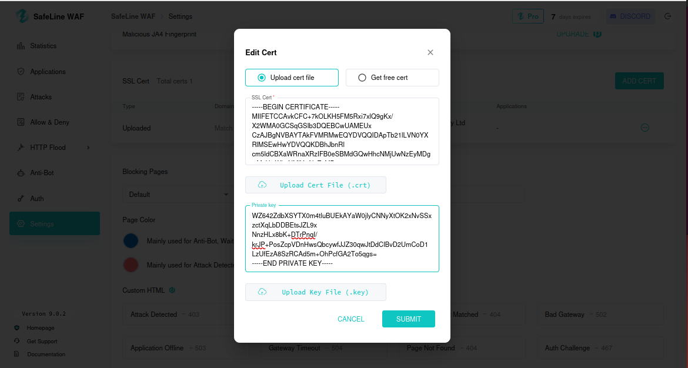
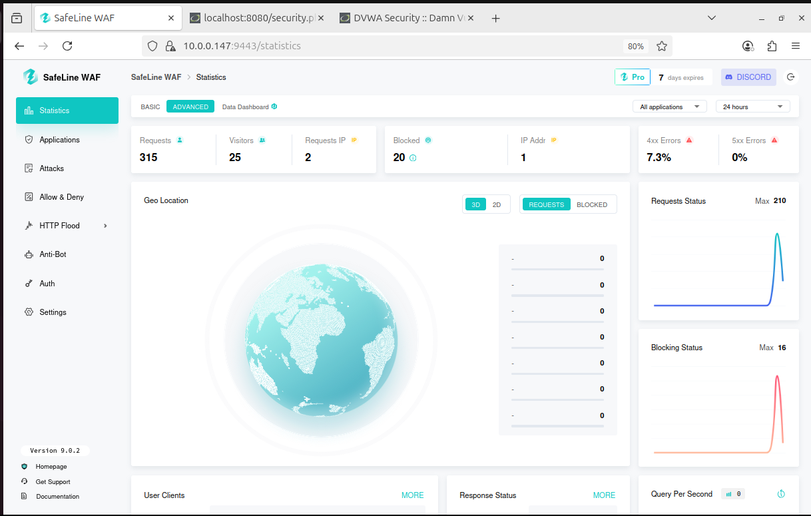

# Safeline-WAF-Project
Cybersecurity homelab with SafeLine WAF, DVWA, Kali Linux and Ubuntu on VMware

Create Your Own Web Application Firewall using SafeLine WAF
# ########################################################################
<details>
  
<summary style="font-weight: bold; color: #2a7ae2; font-size: 1.2em;">Step 1: Installing Both Machines on VMware</summary>

- **Kali Linux (IP: 10.0.0.41)**:
  - Download from [kali.org](https://www.kali.org/get-kali).
  - Install in VMware with 2 GB RAM, 20 GB disk, and bridged networking.
- **Ubuntu Server (IP: 10.0.0.147)**:
  - Download from [ubuntu.com](https://ubuntu.com/download/server).
  - Install with 2 GB RAM, 20 GB disk, and bridged networking.
- **Check IPs and Connectivity**:
  ```bash
  ping 10.0.0.147  # From Kali
  ping 10.0.0.41   # From Ubuntu

<br><br>
  <br><br><br>
  <br><br><br>

</details>

# ########################################################################

<details>

<summary style="font-weight: bold; color: #2a7ae2; font-size: 1.2em;">Step 2: Prerequisites</summary>

<h2>2.1 Clone DVWA from git:</h2>

- Clone DVWA (or download):
  ```bash
  cd /var/www/html
  sudo git clone https://github.com/digininja/DVWA.git

- If git is not installed, install it first:
  ```bash
  sudo apt-get install -y git
<br>
<br>
<h2>2.2.Set File Permissions:</h2>

- 
  ```bash
  sudo chown -R www-data:www-data DVWA
  sudo chmod -R 755 DVWA


<br>
<br>

<h2>2.3 DNS Resolution Setup</h2>


- Edit /etc/hosts on both Kali and Ubuntu:
    ```bash
  sudo nano /etc/hosts

Add:  &ensp;  10.0.0.147 dvwa.local

This will allow to access DVWA at http://dvwa.local:8080/DVWA/ from Kali.

<br><br>
  <br><br><br>
  <br><br><br>


<br>
<br>

<h2>2.4 Ubuntu Configurations</h2>

- Installing OpenSSL
  ```bash
  sudo apt-get install -y openssl

<br><br>
  <br><br><br>


<br>
<br>

- Installing and Configuring LAMP Stack : this install Apache2, PHP and MySQL:
  ```bash
  sudo apt-get install -y apache2 php php-mysql mysql-server
  sudo mysql_secure_installation
Set MySQL root password: ubuntu(for testing purpose).

<br>
<br>

- DVWA has a config file at DVWA/config/config.inc.php. Update it if necessary:
  ```bash
  $DBMS = 'MySQL';
  $db = 'dvwa';
  $user = 'dvwa_user';
  $pass = 'p@ssw0rd';
  $host = 'localhost';

Note: The config.php file may be shwoing as DVWA/config/config.inc.php.dist
Rename to DVWA/config/config.inc.php.

<br><br>
  <br><br><br>


- Create DVWA database:
  ```bash
  sudo mysql -u root -p
  CREATE DATABASE dvwa;
  CREATE USER 'dvwa_user'@'localhost' IDENTIFIED BY 'p@ssw0rd';
  GRANT ALL ON dvwa.* TO 'dvwa_user'@'localhost';
  FLUSH PRIVILEGES;
  exit;

- Create a new database and user in MySQL:
  ```bash
  sudo mysql -u root -p
  CREATE DATABASE dvwa;
  CREATE USER 'dvwa_user'@'localhost' IDENTIFIED BY 'p@ssw0rd';
  GRANT ALL ON dvwa.* TO 'dvwa_user'@'localhost';
  FLUSH PRIVILEGES;
  exit;
<br>

To Initialize DVWA:
Navigate to http://dvwa.local/setup.php in your browser. <br>
Click **`[Create/ResetDatabase]`**. <br>
This will automatically create a random database

<br>
<br>

<h2>2.5. Changing the DVWA Listening Port to 8080</h2>

- Edit Apache configuration:
  ```bash
  sudo nano /etc/apache2/ports.conf

Change:
Listen 80

to:
Listen 8080

<br>

<h2>2.6 Changing the Virtual host to Port</h2>

- Edit the apache Virtual host:
  ```bash
   sudo nano /etc/apache2/sites-available/000-default.conf

Change:
<VirtualHost *:80>

to:
<VirtualHost *:8080>

<br><br>
  <br><br><br>


<br>
<br>

- Restart Apache:
  ```bash
  sudo systemctl restart apache2


</details>

# ########################################################################

<details>

<summary style="font-weight: bold; color: #2a7ae2; font-size: 1.2em;">Step 3: Installing SafeLine in Ubuntu</summary>

- Install SafeLine WAF:
  ```bash
  bash -c "$(curl -fsSLk https://waf.chaitin.com/release/latest/manager.sh)" -- --en
<br> Reference: https://safepoint.cloud/landing/safeline

<br><br>
  <br><br><br>

Access the dashboard at https://10.0.0.147:9443 with provided credentials.

<br><br>
  <br><br><br>


</details>

# ########################################################################

<details>
<summary style="font-weight: bold; color: #2a7ae2; font-size: 1.2em;">Step 4: Using SafeLine</summary>


4.1 SafeLine WAF Dashboard

Application Tab: Add DVWA (www.dvwa.local, port 443, reverse proxy to http://10.0.0.147:8080).
HTTP Flood: Protects against DoS with rate limiting.
Auth: Provides username/password authentication.
Use a 7-day PRO license trial (code: ZFGYUXVXABSUH7KTMQG4FG4B).

<br><br>
Application tab:
Whichever application that we need to be protected, we can link it to the application tab. In our case we are using the DVWA

<br><br>
HTTP flood:
Protect DOS attacks by rate limiting feature and protects from HTTP floods attack

<br><br>
Auth:
Provides username and password authentication for your applications and websites


<br><br>
  <br><br><br>


4.2 Setting up Application Rules

Domain: www.dvwa.local
Port: 443 (HTTPS)
Reverse Proxy: http://10.0.0.147:8080
Requires SSL certificate.

<br><br>
Set the Reverse proxy to our domain(ubuntu) ip: 	10.0.0.147:8080 <br>
Note: What this does is any request to the service is actually coming into the Safeline firewall and on the background it forward the request to port 8080 on the server

<br><br>

4.3 Creating SSL Certificate
- Generate private key:
  ```bash
  openssl genrsa -out private.key 4096

  
- Generate private.csr:
  ```bash
  openssl req -new -key private.key -out private.csr

<br><br>
  <br><br><br>


- Generate SSL certificate:
  ```bash
  openssl x509 -req -days 365 -in private.csr -signkey private.key -out private.crt

<br><br>
  <br><br><br>


Import into SafeLine:

<br><br>
  <br><br><br>


4.4 Testing the Application Rule from Kali Browser
Access http://dvwa.local from Kali; it redirects to https://dvwa.local.  
This rule will allow allow the incoming traffic only through port 443 which is HTTPS.


<br><br>
  <br><br><br>
  <br><br><br>
  <br><br><br>


</details>

# ########################################################################

<details>
  


<summary style="font-weight: bold; color: #2a7ae2; font-size: 1.2em;">Step 5: Setting up HTTP Flood Rules</summary>

Set rate limiting (block IPs after 3 requests in 10 seconds for 5 minutes):

Test by accessing DVWA multiple times from Kali.
Check SafeLine dashboard for blocked IPs.

For testing, if more than 3 access request it made from an ip within 10 seconds the rule is set to to block the ip for 5 mins
<br><br>
  <br><br><br>
  <br><br><br>
We are testing it out by accessing the site form Kali and clicking on multiple options.
The access is denied all of a sudden.
  <br><br><br>
Looking at the HTTP flood request in the Safeline dashboard, the <KALI> ip was blocked. There is also the option to unblock the ip from the dashboard.
  <br><br><br>


</details>

# ########################################################################

<details>
  


<summary style="font-weight: bold; color: #2a7ae2; font-size: 1.2em;">Step 6: Setting Authentication Rule</summary>

Enable authentication in SafeLine:

Credentials for testing: admin / password
<br><br>
  <br><br><br>
Test from Kali; an authentication page appears before DVWA.
  <br><br><br>
The firewall will capture the request, waiting for approval.
<br> Note: The rules can be also set  to auto approve after successful authentication.
  <br><br><br>


</details>

# ########################################################################

<details>
  

<summary style="font-weight: bold; color: #2a7ae2; font-size: 1.2em;">Step 7: Creating Custom Rules</summary>

The ruke is set to deny any request from Kali IP (10.0.0.41):

Add deny rule in SafeLine.

<br><br>
  <br><br><br>
Test from Kali; access is blocked.
  <br><br><br>


</details>

# ########################################################################

<details>


<summary style="font-weight: bold; color: #2a7ae2; font-size: 1.2em;">Step 8: Preventing Attacks</summary>

8.1 Trying SQL Injection with Balanced Rules

In DVWA, set security to low, try SQL injection (e.g., admin' OR '1'='1).
SafeLine blocks it; check dashboard logs :SQL injection blocked by SafeLine.

<br><br>
  <br><br><br>
  <br><br><br>


8.2 Disabling Attack Rules

Disable SafeLine attack rules; SQL injection succeeds, revealing usernames/passwords.
Screenshot: SQL injection succeeds without rules.

<br><br>
  <br><br><br>
  <br><br><br>


Note:<br>
Other attacks such as hping, http floods from CLI, sqlmap etc. can be also performed and monitored using Safeline dashboard.

</details>

# ########################################################################

<details>
  


<summary style="font-weight: bold; color: #2a7ae2; font-size: 1.2em;">Step 9: Statistics Dashboard</summary>

View SafeLine dashboard for request counts, blocked IPs, and attack logs.  


<br><br>
  <br><br><br>


</details>


